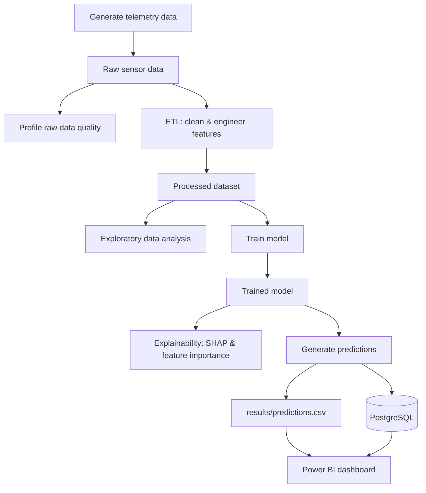

# AI Water Failure Prediction

An end-to-end machine learning platform that predicts failures in water network infrastructure — pumps, pipes, and related assets — from sensor telemetry. The project covers the full lifecycle: synthetic data generation, data quality profiling, ETL cleaning, exploratory analysis, model training, explainability, batch prediction, and persistence to both CSV and PostgreSQL, orchestrated as a single reproducible pipeline and containerised with Docker.

## Architecture



Every stage is orchestrated by `run_pipeline.py`, which runs each script as a subprocess in order and stops the pipeline if any stage fails, logging progress throughout.

## Pipeline stages

| # | Stage | Script | Output |
|---|---|---|---|
| 1 | Generate telemetry data | `src/data/generate_raw_data.py` | `data/raw/water_network_telemetry.csv` |
| 2 | Profile raw data quality | `src/data/profile_raw_data.py` | `reports/raw_data_quality_report.txt` |
| 3 | Clean data & engineer features | `src/data/clean_water_data.py` | `data/processed/clean_water_network_data.csv` |
| 4 | Exploratory data analysis | `src/data/explore_training_data.py` | `reports/metrics/`, `reports/figures/` |
| 5 | Train model | `src/ml/train_failure_model.py` | `models/water_failure_model.pkl`, `reports/metrics/model_metrics.txt` |
| 6 | Explainability | `src/ml/explain_model.py` | `reports/explainability/feature_importance.csv`, SHAP plots |
| 7 | Generate predictions | `src/ml/predict_failure.py` | `results/predictions.csv` and a `predictions` table in PostgreSQL |

> Script paths above reflect the `src/data/` and `src/ml/` layout referenced in pipeline logs — worth a quick check against your actual folder names if `src/` has been reorganised since.

## Model performance

Trained on 120,000 rows of telemetry, 96,000 / 24,000 train/test split, `RandomForestClassifier` with `class_weight="balanced"`:

| Metric | Score |
|---|---|
| Accuracy | 0.9994 |
| Precision | 0.9889 |
| Recall | 0.9903 |
| F1 score | 0.9896 |
| ROC-AUC | 0.9993 |

These numbers come from an actual training run logged during development — pulled from that console output rather than re-derived, so treat them as a snapshot from that run rather than a guaranteed result on every retrain, since synthetic data regeneration or a changed random seed would shift them slightly.

Predictions are bucketed into three risk tiers:

| Failure probability | Risk level | Recommendation |
|---|---|---|
| ≥ 0.75 | HIGH | Immediate inspection and preventive maintenance required |
| 0.40 – 0.75 | MEDIUM | Schedule inspection and monitor asset condition |
| < 0.40 | LOW | Continue normal operation and routine monitoring |

## Explainability

Model decisions aren't a black box here. `src/ml/explain_model.py` generates:
- **Feature importance** (`reports/explainability/feature_importance.csv`) — native scikit-learn importances ranked descending
- **SHAP summary and bar plots** — showing how each feature pushes individual predictions toward or away from a failure classification

This matters for a maintenance context: a risk score alone doesn't tell an engineer what to actually go and check. Knowing *why* the model flagged an asset (e.g. rising vibration combined with an ageing pump) is what turns a prediction into an actionable inspection.

## Project structure

```
.
├── .github/workflows/     # CI pipeline (automated tests on push)
├── config/                # pipeline configuration
├── data/
│   ├── raw/                # generated/incoming telemetry
│   └── processed/          # cleaned, feature-engineered dataset
├── models/                # trained model artifacts (.pkl)
├── reports/
│   ├── metrics/             # training metrics, dataset profile
│   ├── figures/              # EDA distribution and correlation plots
│   └── explainability/       # feature importance, SHAP outputs
├── results/                # batch prediction output (predictions.csv)
├── src/
│   ├── data_generation/
│   ├── data_quality/
│   ├── etl/
│   ├── explainability/
│   ├── utils/
│   └── ml/                   # training, explainability
├── tests/                  # automated test suite
├── .gitignore
├── Dockerfile
├── requirements.txt
├── run_pipeline.py          # orchestrates the full pipeline end to end
└── README.md
```

## Getting started

### Local setup

```bash
git clone https://github.com/Herdaybusy/AI_Water_Failure_Prediction.git
cd AI_Water_Failure_Prediction
python -m venv .venv
.venv\Scripts\activate        # Windows
# source .venv/bin/activate   # macOS/Linux
pip install -r requirements.txt
```

Create a `.env` file in the project root for PostgreSQL persistence (never commit this file — it should already be listed in `.gitignore`):

```
DB_HOST=localhost
DB_PORT=5432
DB_NAME=water_predictions
DB_USER=your_db_user
DB_PASSWORD=your_db_password
```

Run the whole pipeline end to end:

```bash
python run_pipeline.py
```

Or run an individual stage on its own:

```bash
python src/ml/predict_failure.py
```

### Running with Docker

```bash
docker build -t water-failure-prediction .
docker run --env-file .env water-failure-prediction
```

The `--env-file .env` flag passes your database credentials into the container at runtime rather than baking them into the image, keeping secrets out of the built image entirely.

### Running tests

```bash
pytest tests/
```

Tests run automatically on every push via the GitHub Actions workflow in `.github/workflows/`.

## Tech stack

Python · pandas · NumPy · scikit-learn · SHAP · Matplotlib/Seaborn · joblib · SQLAlchemy · psycopg2 · PostgreSQL · pytest · GitHub Actions · Docker · Power BI

## Roadmap

- [x] ETL pipeline with feature engineering
- [x] Model training and evaluation
- [x] SHAP-based explainability
- [x] Batch prediction pipeline
- [x] PostgreSQL persistence
- [x] Automated tests and CI
- [x] Dockerised deployment
- [ ] Power BI dashboard (failure risk, asset health, feature importance, maintenance priority, prediction trends)
- [ ] Validation against real (non-synthetic) sensor data, if access to a real utility dataset becomes available

## Why synthetic data

The telemetry used here is synthetically generated (`src/data/generate_raw_data.py`) rather than sourced from a live water utility, primarily due to data access and privacy constraints around real SCADA/IoT infrastructure data. The generation script deliberately introduces realistic noise, missing values, outliers, and failure-correlated sensor behaviour (e.g. pressure drops and vibration spikes preceding a failure event), so the resulting dataset reflects the kind of signal a real deployment would need to detect — but results here should be read as a proof of concept for the pipeline architecture rather than a validated real-world accuracy figure.

## Status

Active portfolio project. The full pipeline — from raw data generation through to PostgreSQL-backed predictions — is functional and tested. The Power BI visualisation layer is in progress.